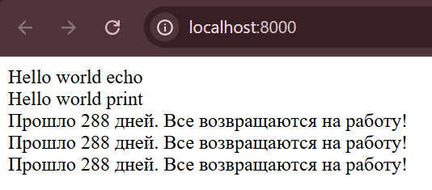

# Установка и запуск локального сервера PHP

Я установила PHP через официальный сайт, скачав архив и добавив путь к интерпретатору PHP. Затем создала файл index.php и запустила локальный сервер с помощью команды: `php -S localhost:8000`

## Первый PHP-скрипт

После запуска локального сервера я начала писать свой первый скрипт.

### Вывод текста на страницу

Я использовала две команды для вывода текста:

`
echo "Hello world echo  ";
print "Hello world print  ";
`

Оператор `echo` и функция `print` выводят текст в браузер, а ` ` добавляет перенос строки.

### Создание и инициализация переменных

`
$days = 288;
$message = "Все возвращаются на работу!";
`

Я объявила переменную `$days` со значением `288` и переменную `$message` с текстом.

### Вывод переменных в строке

`
echo "Прошло " . $days . " дней. " . $message . " ";
echo "Прошло $days дней. $message  ";
print "Прошло $days дней. $message  ";
`

Здесь я использовала два способа объединения переменных и текста:

* Конкатенация (`.`) объединяет строки.
* Вставка переменных внутрь двойных кавычек.

## Ответы на контрольные вопросы

### Какие способы установки PHP существуют?

Есть два основных способа:

1. **Ручная установка**
   * Скачивание архива с PHP.
   * Настройка переменных окружения.
   * Запуск сервера через командную строку.
2. **Через XAMPP**
   * Скачать XAMPP с [официального сайта](https://www.apachefriends.org).
   * Установить, выбрав компоненты Apache, PHP и phpMyAdmin.
   * Запустить XAMPP Control Panel и включить Apache.
   * Открыть `http://localhost` в браузере для проверки работы сервера.

### Как проверить, что PHP установлен и работает?

1. Открыть командную строку (`Win + R` → `cmd`).
2. Ввести команду:  `php -v`
3. Если PHP установлен, отобразится информация о версии.

### Чем отличается `echo` от `print`?

* `echo` быстрее и поддерживает несколько аргументов.
* `print` работает как функция и возвращает `1`, что позволяет использовать его в выражениях.

